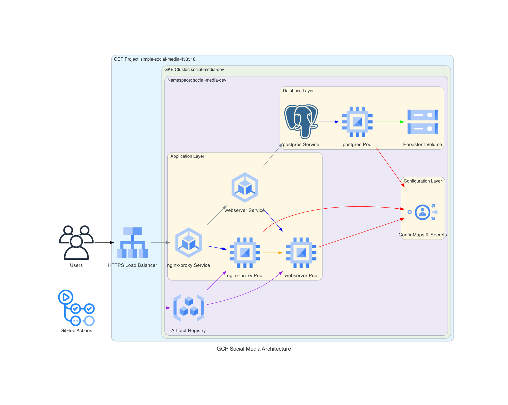

# Social Space

Welcome to Social Space, a modern and scalable social media platform built with Next.js, TypeScript, and Bootstrap. Designed for high availability and performance, the application is containerized, orchestrated, and deployed on Google Cloud Platform (GCP) using Kubernetes and CI/CD automation.


## System Architecture



The application is deployed on GCP with the following architecture:
- **Application Layer**: Frontend (Next.js) and Backend (API) services running on GKE
- **Database Layer**: PostgreSQL database with persistent storage
- **Infrastructure**: 
  - GKE cluster for container orchestration
  - External Load Balancer for traffic management
  - Container Registry for Docker image storage
  - ConfigMaps & Secrets for configuration management
- **CI/CD**: GitHub Actions for automated deployment

## Features

- 🔐 Secure user authentication with Google OAuth
- 👤 Customizable user profiles
- 📝 Create and share posts with image upload
- ❤️ Like and comment on posts
- 🎨 Modern and responsive design
- 🌙 Beautiful UI with Bootstrap
- 🚀 Fast and optimized performance
- 📱 Mobile-friendly interface
- 🔒 Secure file uploads to Google Cloud Storage

## Tech Stack

- **Frontend:**
  - Next.js 14
  - React 18
  - TypeScript
  - Bootstrap 5
  - NextAuth.js

- **Backend:**
  - Next.js API Routes
  - Prisma ORM
  - PostgreSQL

- **Infrastructure:**
  - Google Kubernetes Engine (GKE)
  - Google Cloud Storage
  - Google Container Registry
  - GitHub Actions

## Getting Started

### Prerequisites

- Node.js 18 or later
- npm or yarn
- PostgreSQL database
- Google Cloud Platform account
- Docker

### Local Development Setup

1. Clone the repository:
```bash
git clone https://github.com/yourusername/social-space.git
cd social-space
```

2. Install dependencies:
```bash
npm install
# or
yarn install
```

3. Set up environment variables:
```bash
cp .env.example .env
```

Edit the `.env` file with your configuration:

```env
# Database Configuration
DB_HOST="your-database-host"          # Database host address
DB_PORT="5432"                        # PostgreSQL default port
DB_USER="your-database-user"          # Database username
DB_NAME="your-database-name"          # Database name
DB_SCHEMA="public"                    # Database schema
DB_PASSWORD="your-database-password"  # Database password

# NextAuth.js Configuration
NEXTAUTH_SECRET="your-nextauth-secret"  # Secret key for session encryption
NEXTAUTH_URL="http://localhost:3000"    # Development URL (change in production)

# Google OAuth Configuration
GOOGLE_CLIENT_ID="your-google-client-id"         # From Google Cloud Console
GOOGLE_CLIENT_SECRET="your-google-client-secret"  # From Google Cloud Console

# Google Cloud Storage Configuration
GOOGLE_CLOUD_PROJECT_ID="your-project-id"
GOOGLE_CLOUD_STORAGE_BUCKET="your-bucket-name"
GOOGLE_CLOUD_CLIENT_EMAIL="your-service-account-email"
GOOGLE_CLOUD_PRIVATE_KEY="your-private-key"
```

4. Run database migrations:
```bash
npx prisma migrate dev
```

5. Start the development server:
```bash
npm run dev
# or
yarn dev
```

Visit `http://localhost:3000` to see the application.

## Deployment

### GCP Setup

1. Create a GCP project and enable required APIs:
   - Kubernetes Engine API
   - Container Registry API
   - Cloud Storage API
   - Cloud SQL API

2. Set up GKE cluster:
```bash
gcloud container clusters create social-media-dev \
  --zone=us-central1-a \
  --num-nodes=2 \
  --machine-type=e2-medium
```

3. Configure kubectl:
```bash
gcloud container clusters get-credentials social-media-dev --zone=us-central1-a
```

4. Deploy the application:
```bash
kubectl apply -f k8s/dev/
```

### CI/CD Pipeline

The application uses GitHub Actions for continuous integration and deployment:
- Automated testing
- Docker image building
- GKE deployment
- Database migrations

To skip CI/CD for a specific commit:
```bash
git commit -m "your message [skip ci]"
```

## Project Structure

```
social-space/
├── app/
│   ├── api/            # API routes
│   ├── components/     # Reusable components
│   ├── lib/           # Utility functions
│   └── ...            # Page components
├── k8s/
│   ├── dev/           # Development Kubernetes manifests
│   └── prod/          # Production Kubernetes manifests
├── prisma/
│   └── schema.prisma  # Database schema
├── public/            # Static assets
└── ...
```

## API Routes

- `POST /api/register` - User registration
- `POST /api/login` - User authentication
- `GET /api/posts` - Fetch posts
- `POST /api/posts` - Create new post
- `POST /api/posts/:id/like` - Like a post
- `POST /api/posts/:id/comments` - Comment on a post
- `POST /api/upload` - Upload images to Google Cloud Storage

## Development

### Environment Setup

1. Local Development:
   - Use `.env.local` for local-specific settings
   - Default database URL is provided for local development
   - Google OAuth credentials can be obtained from Google Cloud Console

2. Production Deployment:
   - Update `NEXTAUTH_URL` to your production domain
   - Use secure database credentials
   - Configure proper OAuth redirect URIs in Google Cloud Console
   - Set up proper GCP IAM permissions

### Database Management

- Run `npx prisma generate` after schema changes
- Use `npx prisma studio` to view/edit data
- Backup your database regularly in production
- Monitor database performance using GCP Cloud SQL insights

## Contributing

1. Fork the repository
2. Create your feature branch (`git checkout -b feature/amazing-feature`)
3. Commit your changes (`git commit -m 'Add some amazing feature'`)
4. Push to the branch (`git push origin feature/amazing-feature`)
5. Open a Pull Request

## License

This project is licensed under the MIT License - see the [LICENSE](LICENSE) file for details.

## Acknowledgments

- [Next.js Documentation](https://nextjs.org/docs)
- [React Documentation](https://reactjs.org/)
- [Bootstrap Documentation](https://getbootstrap.com/docs)
- [Prisma Documentation](https://www.prisma.io/docs)
- [NextAuth.js Documentation](https://next-auth.js.org)
- [Google Cloud Documentation](https://cloud.google.com/docs)
- [Kubernetes Documentation](https://kubernetes.io/docs)
